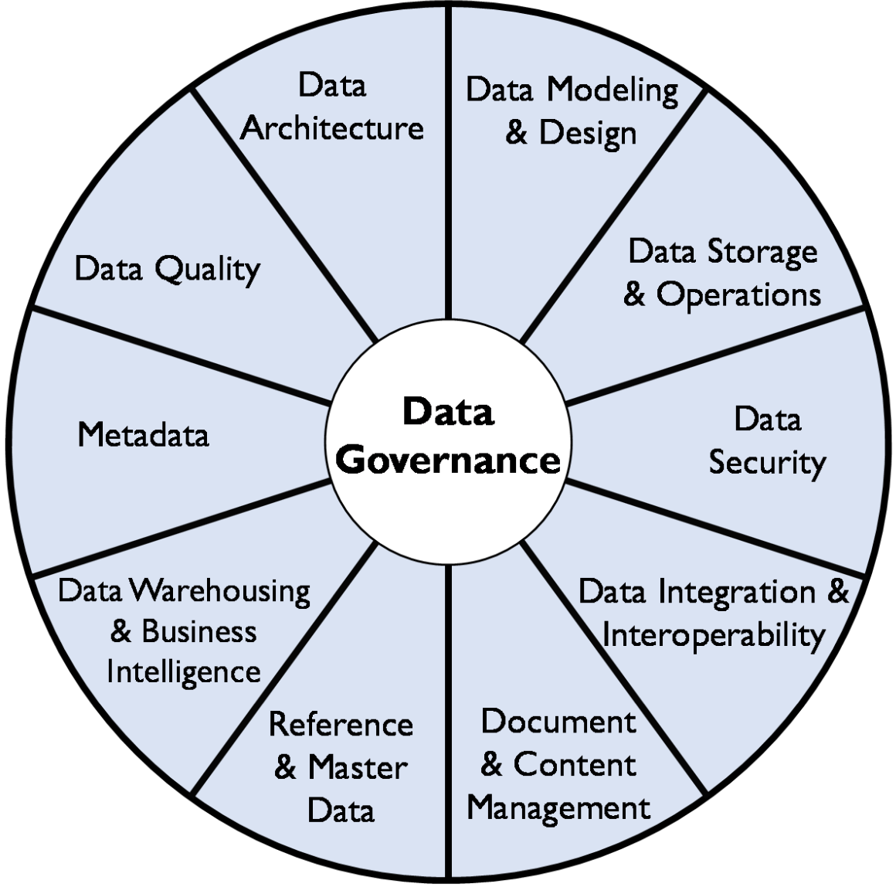
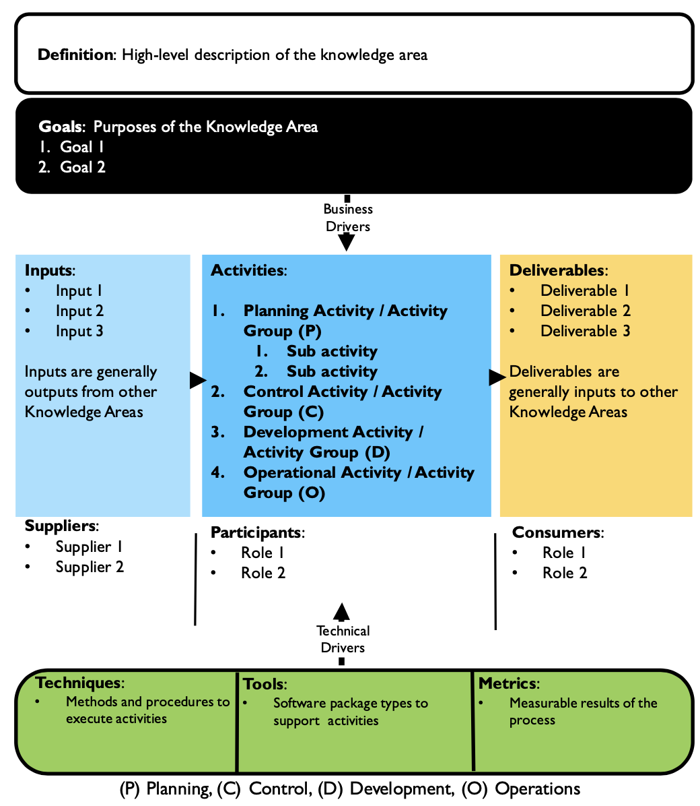

# DMBOK2 Overview
Data management body of knowledge, version 2. 

DMBKOK2 consists of knowledge areas, as illustrated by the DAMA Wheel below.

Each knowledge area is described by using the following generic context diagram.    

