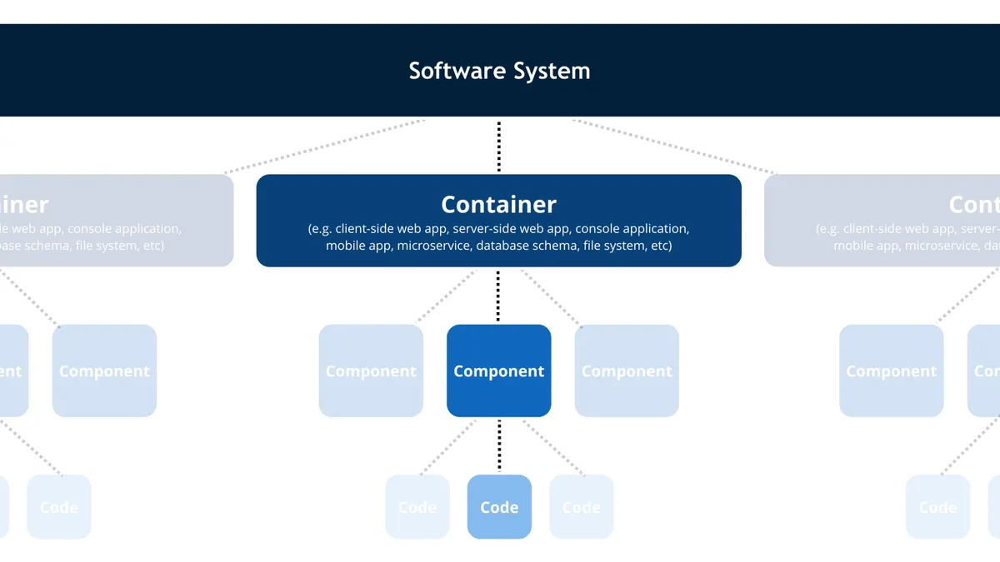
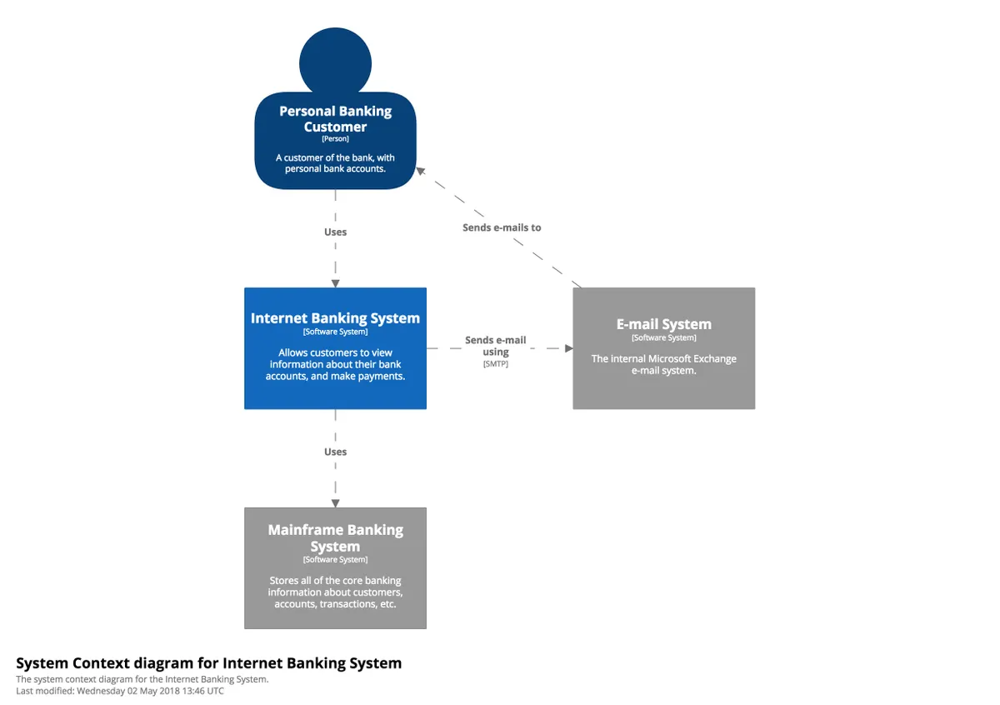
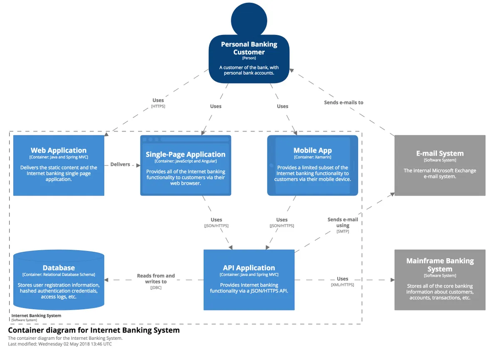

# C4 Model

## Introduction
The C4 model is a lean graphical notation technique for modelling the architecture of software systems. It is based on a structural decomposition of a system into containers and components.

## Core diagrams
The C4 modeling method has 4 core diagrams, for different levels of abastractions:
1. System Context Diagram
Diagram showing your system as a box in the centre, surrounded by its users and the other systems that it interacts with.

2. Container Diagram
Diagram shows the high-level shape of the software architecture and how responsibilities are distributed across it. It also shows the major technology choices and how the containers communicate with one another.

3. Component Diagram
The Component diagram shows how a container is made up of a number of "components", what each of those components are, their responsibilities and the technology/implementation details.

4. Code 
Diagram showing how each component to show how it is implemented as code

## Supplementary diagrams
1. System Landscape Diagram
ssentially this is a high-level map of the software systems at the enterprise level, with a C4 drill-down for each software system of interest. 

2. Dynamic diagram
A diagram showing interactions between sysgtems and components.

3. Deployment diagram
A deployment diagram allows you to illustrate how software systems and/or containers in the static model are mapped to infrastructure.

## Resources
- [C4 Model website](https://c4model.com/)
- [Structurizr](https://structurizr.com/)

