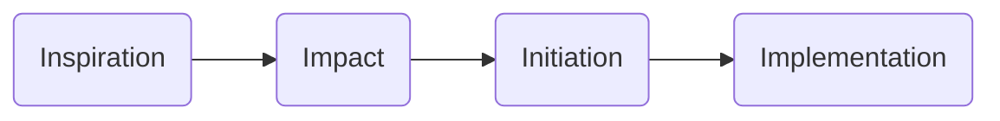

Document status: {{status}}
---

# Phase - Inspiration

# Phase - Impact
During this phase a standard approach is applied, which consists a number of workshops per topic. 
Before starting these workshops information is collected:
- In advance, talking to a few key contacts, a stakeholder map is compiled, indicating interest vs influence regarding the overall project.
- Mission
- Strategy
- Vision
- Organisation Chart
- IT landscape
- Primary systems 
- Leading systems per data category
- Integration between systems
- Owners of systems
- Main company processes
- Stakeholders 
- Policies regarding security, privacy
- Architecture principles

## Workshops
1. Strategy
1. Architecture & Governance
1. Planning & Organisation
1. Backlog & Roadmap
1. Change & Adoption
1. Operations
1. Data Driven Organisation

Overall Output:
- One Pager
- High level planning (e.g. 5 sprints of 2 weeks, and deliverables)
- Strategy
- Solution Architecture
- Roadmap & Backlog
- Projectorganisation en collaboration structure
- Maintenance & Support Strategy

The contents of the workshops are described in more detail below.

### Workshop: Strategy  
_Topics_
- Rationale 
- Scope 
- Stakeholders 
- Organisation & Processes 
- IT Organisation 
- Maturity, Epics, Landscape, Platform 
- Core Systems 
- Future changes in IT landscape 
- Key datasources, internal & external
- Matrix Use Cases x Analytic Capabilities (e.g. real time analytics, dq, management reporting, ..)

_Method_
Workshop, with 15 minutes per topic. All relevant stakeholders are invited for these stakeholders.

Purpose, goal and method are sent out at least a week in advance.

_Deliverable_
The output of this workshop is a document (chapter) and a presentation.

### Workshop: Architecture & Governance
_Topics_
- Recap data strategy
- Infra and Networking Requirements
- Data characteristics of source systems
- Data platform model (data mesh, central, reporting only, etc.)
- Sensitive data, classification (high level)
- Security: AAD, guest accounts?, vnets (high impact on development time!!)
- Data freshness requirement
- Data integration
- Cost management, tagging, limits, alerts, responsibilities
- Number of environments, and their purpose
- Structure re tenant, subscriptions, resource groups, 
- Build and release automation
- Support requirements, logging monitoring
- Management groups
- Data refresh frequencies, restartability
- Data quality
- BCM / DR
- Data governance
- Historisation
- Master data management
- Per source system:
    - Data life cycle
    - Type of data
    - Data volume
    - Connection: technology, push / pull
    - Sensitivity

_Method_
Method used is a workshop. Participants are informed before hand.
- All architectural decisions are logged, including date, decision makers, rationale

_Deliverable_
The output of this workshop is a document (chapter) and a presentation.
The document describes the **Solution Architecture**

## Workshop: Planning & Organisation
_Topics_
- Scope
- Roles and Responsibilities
- Commitment
    - Time invested / required by the customer
    - Which roles are needed when
- Expertise & Experience
- Tooling
    - Jira / DevOps
    - Project site (MS Teams?)
- Way of Working
    - Definition of Done
    - Definition of Ready
    - Testing: unit test, system integration test, 
    - Branching strategy
    - Environments

## Workshop: Backlog & Roadmap
_Topics_
- Epics and Prio
- Create stories for Prio 1 / Coming quarter

## Workshop: Change & Adoption
_Topics_
- Communication
- Channels
- Training

_Method_
- ADKAR
- Training

## Workshop: Operations
Difference between maintenance and support.

_Topics_
- Support process: 1st, 2nd, 3rd line 
- SLA, 24x7, office hours, response times, max P1 incidents per year
- Data contracts
- Ticketing system
- DAP

_Method_

## Workshop: Data Driven Organisation
_Topics_
For topics below define current and ambition level
- Culture & Humans
- Maturity
- Data Management
- Data Governance

_Method_

_Deliverable_

Output of this workshop is input for Change & Adoption

# Initiation

# Implementation
