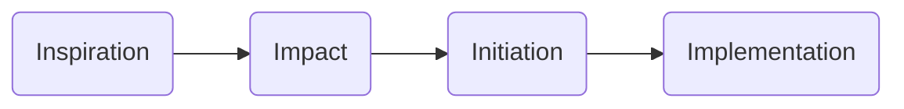

# Project Management Methodologies
This section contains various methodologies for project management. 
This includes traditional waterfall and agile methodologies.

# Data and Analytics
For Data and Analytics projects the below phases are suggested. 

As an alternative, consider the phasing below:

More info on this alternative can be found [here](/Methodologies/ProjectManagement/DnA_Methodology_I)

