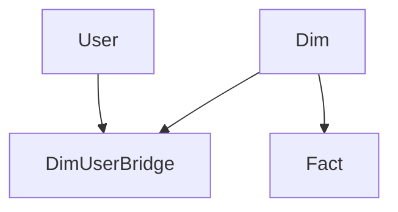

# Dynamic RLS
Steps:
- Create Role in PBI Service
- Create BridgeTable between User and Dimension Table
- Create Datamodel in PowerBI Desktop:

- Note the direction of the arrows. These are very relevant for PBI. 
- Write DAX code using LOOKUP for each Dimension

# Static RLS
